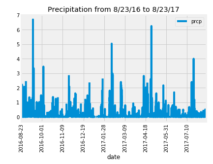
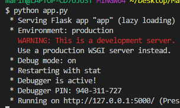
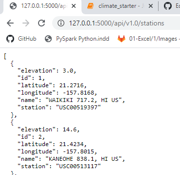

# HAWAII WEATHER

This project is focused on data storage and retrieval. Takes advantage of SQL, [Structured Query Languaje](https://en.wikipedia.org/wiki/SQL), to deal with relational databases. [SQLAlquemy's ORM, object-relational mapper](https://www.sqlalchemy.org/), is used to facilitate the communication between Python and databases.

## PROBLEM:

### Requirements 
The main requirements are: 
- Python
- Numpy
- Matplotlib
- Pandas
- SQLAlchemy and Object Relational Mapper
- datetime
- Flask 

## Data
## Part 1- DataBase and Connection
The database [hawaii.sqlite](Resources/hawaii.sqlite) consist in two tables measurements and stations. To inspect the database use for example SQLite

ETL: The two tables are also as a csv files [hawaii_measurements.csv](Resources/hawaii_measurements.csv) and [hawaii_stations.csv](Resources/hawaii_stations.csv). I could start by inspecting the csv files for NaNs and missing values and deciding what to do. In the case of values like temperature and precipitation doing a interpolation may be not misleading. However cleaning data is one of the most important steps and cannot be taken ligthly. Once data from tha tables is cleaned, the tables can be joined in SQL by using the engine and connection string to create a database in SQLite or Postgres. In this case I am using the joined database hawaii.sqlite. 

The first step is accesing the data in Python with SQLAlchemy. In this case I used directly the database joined in SQLite.  [Engine](https://docs.sqlalchemy.org/en/13/core/engines.html) as a starting point. The connection with database is done using SQLAlchemy create_engine, and automap_base() to reflect the tables into two classes Measurement and Stations. The query session starts with session.query   
## Part 2- Analysis
# Precipitation analysis:
I queried the last 12 months of precipitation and load the results into Pandas Dataframe to be ploted using Matplotlib libraries. 

# Station analysis:
I queried the stations, the most active,  and the temperature distribution for the last 12 months of the most active station. The data is ploted as a histogram using Matplotlib libraries.
# Temperature analysis:
After choosing the dates for a trip, the average temperature and other statistics can be easyly calculated in Python.

## Part 3- Results App : quick prototyping. A way to show the results usign flask.
The data and queries can be easily presented in a FLASK API on a localy by executing the app.py from the VS terminal "> python app.py" and opening the local server http://127.0.0.1:5000/

Routes created are:
- /api/v1.0/precipitation
  Json representation (list of dictionaries) of precipitation measurements for the last year of data in the dataset, from August 2016 to August 2017. The api data is converted into a valid json object using "jsonify".
- /api/v1.0/stations
  Json representation (list of dictionaries) of weather stations in Hawaii.
- /api/v1.0/tobs
  Json representation of the observed temperature from August 2016 to August 2017
- /api/v1.0/v1.0/temp/<start>
  Type a single date ( for example 2016-08-23) to know min, max and avg temp
- /api/v1.0/v1.0/temp/<start>/<end>
   Type a range (for example 2016-08-23/2016-08-28) to know min, max and avg temp

