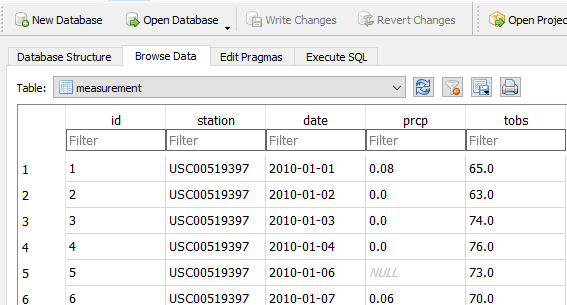

# HAWAII WEATHER

This project is focused on data storage and retrieval. Takes advantage of SQL, [Structured Query Languaje](https://en.wikipedia.org/wiki/SQL), to deal with relational databases. [SQLAlquemy's ORM, object-relational mapper](https://www.sqlalchemy.org/), is used to facilitate the communication between Python and databases.

## PROBLEM:

### Requirements 
The main requirements are: 
- Python
- Numpy
- Matplotlib
- Pandas
- SQLAlchemy and Object Relational Mapper
- datetime 

## Data
## Part 1- Data Engineering
The database [hawaii.sqlite](Resources/hawaii.sqlite) consist in two tables measurements and stations. To inspect the database use for example SQLite

The two tables are also as a csv files [hawaii_measurements.csv](Resources/hawaii_measurements.csv) and [hawaii_stations.csv](Resources/hawaii_stations.csv)

## Part 4- Results App
The data ad queries can be easily presented in a FLASK API. 
Routes created are:
- /api/v1.0/precipitation
  Precipitation from August 2016 to August 2017
- /api/v1.0/stations
  List of weather stations in Hawaii
- /api/v1.0/tobs
  Observed temperature from August 2016 to August 2017
- /api/v1.0/v1.0/temp/<start>
  Type a single date ( for example 2016-08-23) to know min, max and avg temp
- /api/v1.0/v1.0/temp/<start>/<end>
   Type a range (for example 2016-08-23/2016-08-28) to know min, max and avg temp
  
  

